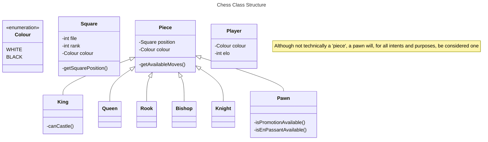

# skatd-chess
Chess app built by zeeshan bari & mohammed mirajkar.

## Table of Contents
* [Introduction, Goals, and Requirements](#introduction)
     * [Chess](#chess)
       * [Functional Requirements](#chess-func-req)
       * [Non-Functional Requirements](#chess-nonfunc-req)
       * [Possible Extended Improvements](#chess-extended-req)
     * [Messaging](#messaging)
       * [Functional Requirements](#messaging-func-req)
       * [Non-Functional Requirements](#messaging-nonfunc-req)
       * [Possible Extended Improvements](#messaging-extended-req)

## Introduction, Goals, and Requirements 
The idea is to emulate, only at a fundamental level, our favourite chess web app - lichess, and make improvements wherever possible.
We want to build our app for the [scale of lichess](https://www.similarweb.com/website/lichess.org/#competitors), down the line improvements, and general maintainability.
It's important to note that lichess is open source and publishes [a complete set of its entire tech stack](https://github.com/lichess-org/lila#lichessorg) but it'll be more fun to try to make it better considering we have the flexibility to perhaps do so. Also, I have no hope of understanding [this](https://raw.githubusercontent.com/lichess-org/lila/master/public/images/architecture.png) on first glance.
Major components are broken down below.

## Chess 

### Requirements
#### Functional Requirements 
1. **Guests** may sign-up/sign-in at which point they become **Users**.
2. Users/Guests should be able to play a full timed chess game with another paired, searched, friended, or anonymous player.
3. Game history should be available.
4. Elo system to rank players and communicate skill levels.
   
#### Non-Functional Requirements & Tradeoffs 
1. Users should have a real-time search experience with minimum latency
2. PAC: Consistency of the application should be valued above availability - In the case of a partition failure, we would want to temporarily halt operations rather than allow the users to play to maintain a globally consistent game state (ie. time, moves made) ie. it would be less inconvenient for network splits to cause both sides to see a temporarily frozen game than for time mismatches between the two users in a given game.
3. ELC: Outside of network failures, we should still favour consistency over latency since despite it being a real time application, any deviance between user expereinces would not be worth the improvement in latency.

## Design & Implementation
### Low Level Design

